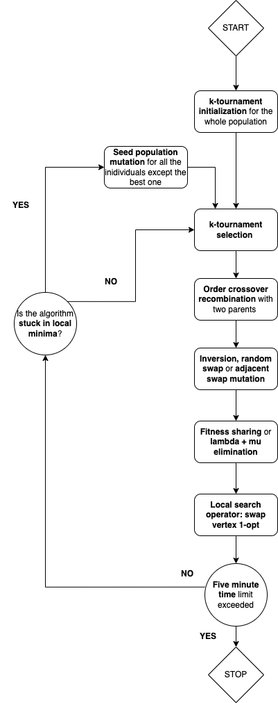

# GA-TSP
The 2022–2023 project assignment for the Genetic Algorithms and Evolutionary Computing  course at KU Leuven. I developed an evolutionary algorithm for the traveling salesperson problem. There is loads of room for improvement.

# Genetic algorithm design

## Built With

- [Numba](https://numba.pydata.org/)
- [Numpy](https://numpy.org/)
- [Python version 3.10](https://www.python.org/downloads/release/python-3100/)

